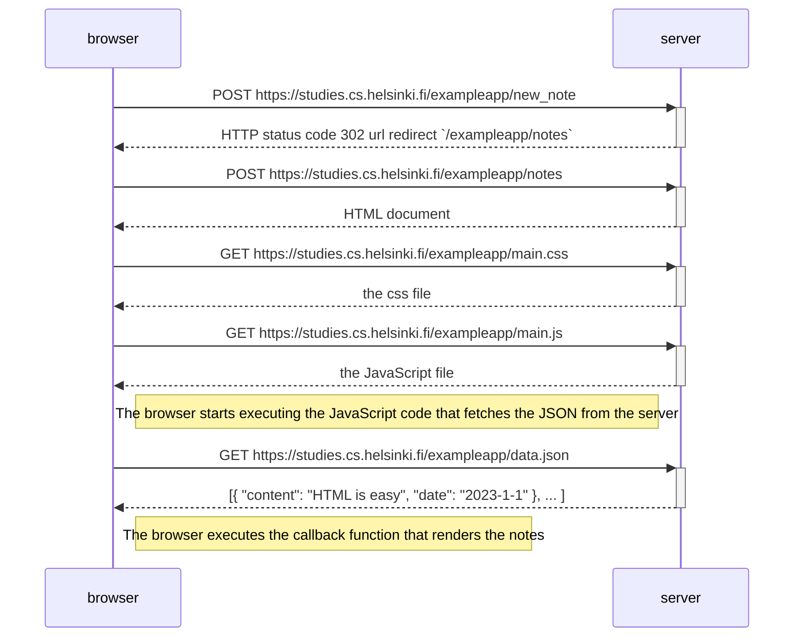
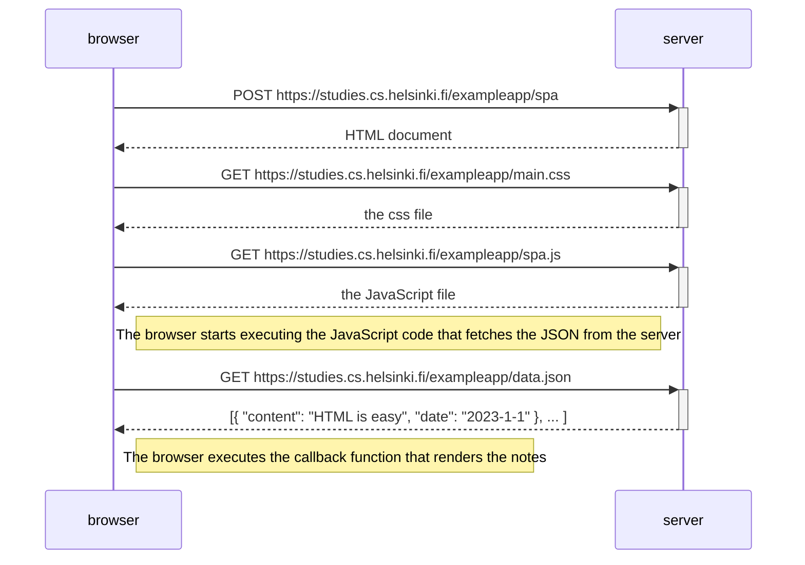
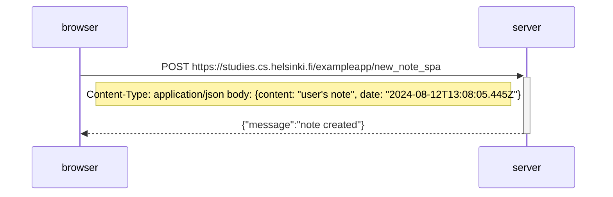

# [Fundamentals of Web apps](https://fullstackopen.com/en/part0/fundamentals_of_web_apps)

## 0.4: New note diagram

```mermaid
sequenceDiagram
    participant browser
    participant server
    
    browser->>+server: POST https://studies.cs.helsinki.fi/exampleapp/new_note
    server-->>-browser: HTTP status code 302 url redirect `/exampleapp/notes`
    browser->>+server: POST https://studies.cs.helsinki.fi/exampleapp/notes
    server-->>-browser: HTML document
    browser->>+server: GET https://studies.cs.helsinki.fi/exampleapp/main.css
    server-->>-browser: the css file
    browser->>+server: GET https://studies.cs.helsinki.fi/exampleapp/main.js
    server-->>-browser: the JavaScript file
    Note right of browser: The browser starts executing the JavaScript code that fetches the JSON from the server
    browser->>+server: GET https://studies.cs.helsinki.fi/exampleapp/data.json
    server-->>-browser: [{ "content": "HTML is easy", "date": "2023-1-1" }, ... ]
    Note right of browser: The browser executes the callback function that renders the notes

```

## 0.5: Single page app

```mermaid
sequenceDiagram
    participant browser
    participant server
    
    browser->>+server: POST https://studies.cs.helsinki.fi/exampleapp/spa
    server-->>-browser: HTML document
    browser->>+server: GET https://studies.cs.helsinki.fi/exampleapp/main.css
    server-->>-browser: the css file
    browser->>+server: GET https://studies.cs.helsinki.fi/exampleapp/spa.js
    server-->>-browser: the JavaScript file
    Note right of browser: The browser starts executing the JavaScript code that fetches the JSON from the server
    browser->>+server: GET https://studies.cs.helsinki.fi/exampleapp/data.json
    server-->>-browser: [{ "content": "HTML is easy", "date": "2023-1-1" }, ... ]
    Note right of browser: The browser executes the callback function that renders the notes
```

## 0.6: New note in Single page app diagram

```mermaid
sequenceDiagram
    participant browser
    participant server
    
    browser->>+server: POST https://studies.cs.helsinki.fi/exampleapp/new_note_spa 
    Note right of browser: Content-Type: application/json body: {content: "user's note", date: "2024-08-12T13:08:05.445Z"}
    server-->>-browser:{"message":"note created"}

```
